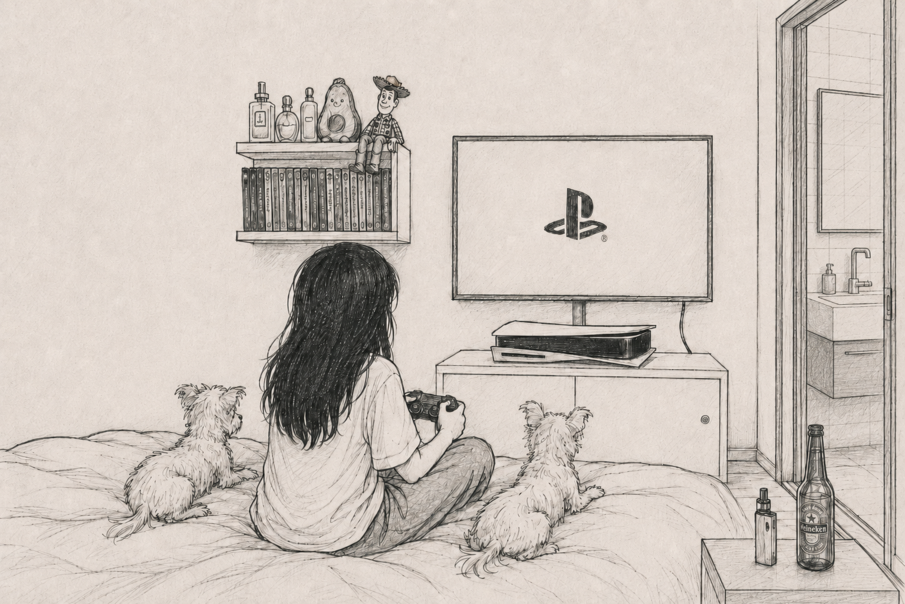

Essas sugestões possuem caráter meramente informativo e não vinculante (não vale falar mal do meu gosto depois).
Vamos tentar explorar gêneros que você não tem o costume de jogar para tentar expandir os horizontes.

<nav class="genre-nav" markdown="1">
- [Action](#action)
- [Action/Adventure](#action-adventure)
- [Action/Passar Raiva](#action-passar-raiva)
- [Action/Simulation](#action-simulation)
- [Adventure](#adventure)
- [Adventure/Puzzle](#adventure-puzzle)
- [Beat 'Em Ups](#beat-em-ups)
- [Character Action](#character-action)
- [Fighting](#fighting)
- [FPS](#fps)
- [Open World](#open-world)
- [RPG](#rpg)
- [Stealth](#stealth)
- [Terror](#terror)
</nav>

# Action

## Space Marine 2

Incorpore a habilidade sobre-humana e a brutalidade de um Space Marine. Use habilidades letais e armamento devastador para obliterar os implacáveis enxames Tyranid. Defenda o Império em uma espetacular ação em terceira pessoa, sozinho ou em modo multijogador.

Terceira Pessoa Co-op Warhammer 40K Hack and Slash

# Action/Adventure

## Ratchet & Clank: Rift Apart

Abra caminho à força por uma aventura interdimensional com Ratchet e Clank. Ajude-os a enfrentar um imperador maligno de outra realidade, saltando entre mundos repletos de ação em alta velocidade.

Plataforma Sci-Fi Single-player Família

## Star Wars Jedi: Survivor

A história de Cal Kestis continua neste jogo de ação e aventura em terceira pessoa ambientado no universo Star Wars. Cinco anos após os eventos de Jedi: Fallen Order, Cal enfrenta uma luta cada vez mais desesperada à medida que a galáxia se torna mais sombria, cercado por ameaças novas e familiares como um dos últimos Cavaleiros Jedi sobreviventes.

Star Wars Terceira Pessoa Narrativa Single-player

## Star Wars Outlaws

O primeiro jogo de mundo aberto de Star Wars já feito. Explore locais marcantes e inéditos pela galáxia e arrisque tudo na pele da vigarista Kay Vess, em busca de liberdade e dos meios para começar uma nova vida.

Star Wars Mundo Aberto Aventura Single-player

## Guardians of the Galaxy

Embarque em uma jornada selvagem pelo cosmos com uma nova visão dos Guardiões da Galáxia da Marvel. Neste jogo de ação e aventura, você é o Senhor das Estrelas, liderando os imprevisíveis Guardiões de uma explosão de caos para outra.

Super-heróis Narrativa Humor Single-player

## A Plague Tale: Innocence

Acompanhe a triste história de Amicia e seu irmão mais novo, Hugo, em uma jornada pelos momentos mais sombrios da história. Caçados por soldados da Inquisição e rodeados por enxames implacáveis de ratos, os dois aprenderão a confiar um no outro para sobreviver na França de 1349, devastada pela peste.

Stealth Narrativa Atmosférico Single-player

## A Plague Tale: Requiem

Embarque em uma comovente jornada por um cativante mundo brutal distorcido por forças sobrenaturais. Depois que seu lar foi devastado, Amicia e Hugo viajam para o sul tentando controlar a maldição dele. Mas quando os poderes de Hugo retornam, morte e destruição voltam com uma enxurrada de ratos famintos, forçando os irmãos a fugir mais uma vez.

Stealth Narrativa Sobrenatural Single-player

[Voltar ao topo](#top)

# Action/Passar Raiva

## Returnal

Quebre o ciclo. Lute para sobreviver neste premiado jogo de tiro em terceira pessoa que traz a história de Selene. Enfrente desafios roguelike e batalhas frenéticas de bullet hell. Compartilhe sua jornada por Returnal com outro jogador.

Roguelike Bullet Hell Sci-Fi Difícil

## Saros

SAROS é um jogo de ação com uma história sombria sobre uma colônia perdida no espaço em Carcosa, sob um eclipse ameaçador. Você controla Arjun Devraj, um poderoso Soltari Enforcer disposto a tudo para encontrar quem procura.

Roguelike Sci-Fi Atmosférico Em Desenvolvimento

## Sekiro

Trace seu próprio caminho rumo à vingança nesta premiada aventura da FromSoftware, criadora de Bloodborne e da série Dark Souls. Vingue-se. Restaure sua honra. Mate de forma engenhosa.

Souls-like Difícil Ninja Single-player

## Elden Ring

Erga-se, Maculado(a), e seja guiado pela graça para empunhar o poder do Elden Ring e se tornar um Lorde Prístino nas Terras Intermédias, neste RPG de ação e fantasia aclamado pela crítica.

Souls-like Mundo Aberto Fantasia Difícil

## Hades II

A primeira sequência de Supergiant Games aprimora os aspectos mais divinos do roguelike de masmorras do jogo original, em uma experiência repleta de ação e infinitamente rejogável, enraizada no Submundo da mitologia grega e suas conexões com o início da bruxaria.

Roguelike Mitologia Grega Hack and Slash Narrativa

[Voltar ao topo](#top)

# Action/Simulation

## Ace Combat 7

Torne-se um piloto ás e voe por céus fotorrealistas com movimento de 360 graus completo; abata aeronaves inimigas e sinta a emoção de sortidas realistas. O combate aéreo nunca pareceu ou foi tão bom!

Simulador de Voo Combate Aéreo Arcade Single-player

[Voltar ao topo](#top)

# Adventure

## Dispatch

Dispatch é uma comédia de ambiente de trabalho com super-heróis, onde as escolhas importam. Você é Robert Robertson, o Mecha Man, que após perder seu mech-suit numa batalha, vira despachante de um centro de super-heróis, gerenciando uma equipe de ex-supervilões.

Narrativa Comédia Escolhas Episódico

## Her Story

Uma mulher é interrogada sete vezes pela polícia. Pesquise no banco de dados de vídeos e explore centenas de clipes autênticos para descobrir a sua história neste premiado e revolucionário jogo narrativo.

Mistério Live-Action Investigação Narrativa

## Immortality

Marissa Marcel era uma estrela de cinema. Ela fez três filmes. Mas nenhum deles chegou a ser lançado. E Marissa Marcel desapareceu. Uma trilogia interativa de Sam Barlow, criador de Her Story.

Mistério Live-Action Interativo Narrativa

[Voltar ao topo](#top)

# Adventure/Puzzle

## Outer Wilds

Eleito Jogo do Ano de 2019 por Giant Bomb, Polygon, Eurogamer e The Guardian, Outer Wilds é um mistério de mundo aberto aclamado pela crítica sobre um sistema solar preso em um loop temporal infinito.

Exploração Mundo Aberto Loop Temporal Sci-Fi

## Gorogoa

Gorogoa é uma evolução elegante do gênero de quebra-cabeças, contada através de uma história belamente ilustrada à mão por Jason Roberts. Vencedor de Jogo de Debut no BAFTA Games Awards de 2018.

Puzzle Arte Curto Narrativa

## Papers, Please

O estado comunista de Arstotzka acabou de encerrar uma guerra de 6 anos com a vizinha Kolechia e retomou sua parte legítima da cidade fronteiriça de Grestin. Você foi selecionado por loteria de trabalho para atuar no Ministério de Admissão do Posto de Fronteira de Grestin.

Puzzle Simulação Distopia Indie

## Return of the Obra Dinn

Return of the Obra Dinn é uma aventura de mistério em primeira pessoa baseada em exploração e dedução lógica, na qual você investiga o destino misterioso da tripulação de um navio desaparecido.

Mistério Dedução Pixel Art Investigação

[Voltar ao topo](#top)

# Beat 'Em Ups

## Teenage Mutant Ninja Turtles: Shredder's Revenge

Teenage Mutant Ninja Turtles: Shredder's Revenge reúne Leonardo, Michelangelo, Donatello e Raphael em um espetacular jogo de luta em rolagem lateral que evoca o visual clássico das Tartarugas de 1987 e homenageia jogos clássicos como Turtles In Time, criado pelos especialistas em beat 'em up da Dotemu e Tribute Games.

Beat 'em up Co-op Pixel Art Retrô

## Streets of Rage 4

O retorno da lendária série Streets of Rage. Gráficos lindos e totalmente desenhados à mão pelo estúdio responsável pelo visual de Wonder Boy: The Dragon's Trap. Limpe a Wood Oak City sozinho ou com um amigo online!

Beat 'em up Co-op Arte Desenhada à Mão Retrô

[Voltar ao topo](#top)

# Character Action

## Devil May Cry 5

O caçador de demônios definitivo está de volta com estilo, no jogo que os fãs de ação estavam esperando.

Hack and Slash Estiloso Demônios Single-player

## Bayonetta

A hipnotizante Bruxa Umbra ressurge das profundezas após meio milênio de descanso, sem se lembrar de seu passado misterioso, e é lançada imediatamente à batalha onde deve eliminar seus inúmeros inimigos para descobrir a verdade.

Hack and Slash Estiloso Bruxaria Single-player

[Voltar ao topo](#top)

# Fighting

## Tekken 8

TEKKEN 8 é o mais novo capítulo da série TEKKEN, o ápice dos jogos de luta em 3D. Entre na luta com mais de 32 personagens e seja testemunha do próximo episódio dessa épica saga.

Luta Competitivo Online 3D

[Voltar ao topo](#top)

# FPS

## Metro 2033 Redux

A versão definitiva do clássico cult 'Metro 2033', reconstruída na mais recente versão da 4A Engine. Em 2013 o mundo foi devastado por um evento apocalíptico, aniquilando quase toda a humanidade e transformando a superfície da Terra em um deserto venenoso. Um punhado de sobreviventes se refugiou nas profundezas do metrô de Moscou. O ano é 2033.

Survival Horror Pós-apocalíptico Atmosférico Narrativa

## Metro: Last Light Redux

A versão definitiva do aclamado 'Metro: Last Light', reconstruída na mais recente versão da 4A Engine. Uma aventura épica que combina horror de sobrevivência, exploração e combate tático com furtividade, em uma das experiências de FPS narrativo mais imersivas já criadas.

Survival Horror Pós-apocalíptico Stealth Narrativa

## Metro Exodus

Metro Exodus é um épico FPS narrativo da 4A Games que combina combate mortal e furtividade com exploração e horror de sobrevivência em um dos mundos de jogo mais imersivos já criados.

Mundo Aberto Survival Horror Pós-apocalíptico Narrativa

[Voltar ao topo](#top)

# Open World

## Mafia: The Old Country

Descubra as origens do crime organizado nesta conturbada história de máfia ambientada no submundo brutal da Sicília do início do século XX. Lute para sobreviver como Enzo Favara e prove seu valor para a Cosa Nostra nesta envolvente ação em terceira pessoa.

Máfia Terceira Pessoa Narrativa Single-player

[Voltar ao topo](#top)

# RPG

## Skyrim

A fantasia épica renasce. O próximo capítulo da aclamada saga Elder Scrolls chega dos criadores dos Jogos do Ano de 2006 e 2008, a Bethesda Game Studios. Skyrim reimagina e revoluciona o épico mundo aberto de fantasia.

Mundo Aberto Fantasia Exploração Moddable

## Mass Effect

Inclui o conteúdo single-player base e mais de 40 DLCs de Mass Effect, Mass Effect 2 e Mass Effect 3, incluindo armas, armaduras e pacotes promocionais — remasterizados e otimizados para 4K Ultra HD.

Sci-Fi Escolhas Espaço Trilogia

## The Outer Worlds 2

A sequência do premiado RPG de ficção científica em primeira pessoa da Obsidian Entertainment. Como agente do Diretório Terrestre, use toda sua ousadia e charme para desvendar a origem das fendas devastadoras que ameaçam destruir a humanidade, em uma jornada repleta de ação com nova tripulação, novas armas e novos inimigos.

Sci-Fi Humor Escolhas Primeira Pessoa

## Avowed

Ambientado no mundo fictício de Eora, apresentado pela primeira vez na franquia Pillars of Eternity, Avowed é um RPG de ação e fantasia em primeira pessoa da premiada equipe da Obsidian Entertainment. Como porta-voz de Aedyr, investigue uma praga misteriosa que espalha o caos pelas Terras Férteis — uma busca que evolui para algo pessoal, com escolhas que mudam o destino de seu povo e o seu próprio.

Fantasia Primeira Pessoa Escolhas Exploração

[Voltar ao topo](#top)

# Stealth

## Metal Gear Solid V: The Phantom Pain

Nove anos após os eventos de Ground Zeroes e a queda da Militaires Sans Frontières, Snake (também conhecido como Big Boss) desperta de um coma de quase nove anos. Mundo aberto, liberdade tática total e infiltração: monte sua missão do seu jeito num conflito que ultrapassa nações e ideologias.

Mundo Aberto Tático Espionagem Sandbox

## Metal Gear Solid Δ: Snake Eater

O remake completo de METAL GEAR SOLID 3: SNAKE EATER, com a mesma história envolvente e mundo cativante, agora com gráficos totalmente novos e áudio 3D que realçam a atmosfera da selva. No auge da Guerra Fria, Naked Snake — o homem que mais tarde seria conhecido como Big Boss — se infiltra na União Soviética para escoltar um cientista desertor.

Guerra Fria Espionagem Remake Sobrevivência

## Dishonored 2

Assuma novamente o papel de um assassino sobrenatural em Dishonored 2, a sequência do premiado jogo de ação em primeira pessoa Dishonored. Quinze anos após os eventos do primeiro jogo, uma nova ameaça maligna surge e Emily Kaldwin, a jovem Imperatriz, é destronada. Sozinha ou com o lendário assassino Corvo Attano, parta para reconquistar o trono usando armas letais e poderes sobrenaturais.

Mundo Aberto Poderes Sobrenaturais Escolhas Primeira Pessoa

[Voltar ao topo](#top)

# Terror

## Silent Hill f

Uma névoa envolve a cidade natal de Hinako, levando-a a lutar contra monstros grotescos e solucionar quebra-cabeças sinistros. Descubra a beleza perturbadora escondida no terror.

Survival Horror Atmosférico Psicológico Narrativa

## FATAL FRAME II: Crimson Butterfly REMAKE

Um remake completo do segundo título da série FATAL FRAME (PROJECT ZERO). As irmãs gêmeas Mio e Mayu se perdem em uma vila abandonada assombrada por espíritos vingativos, onde a noite nunca termina. Mio tenta encontrar Mayu e escapar, enfrentando fantasmas com a Camera Obscura, uma câmera capaz de fotografar o impossível.

Survival Horror Fotografia Atmosférico Remake

[Voltar ao topo](#top)
